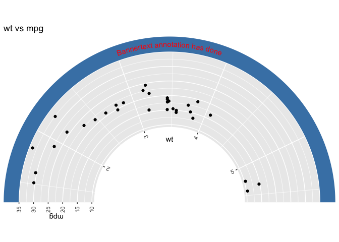
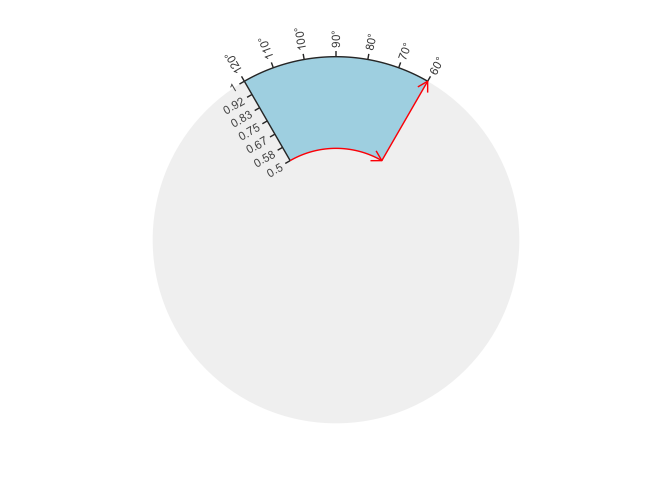
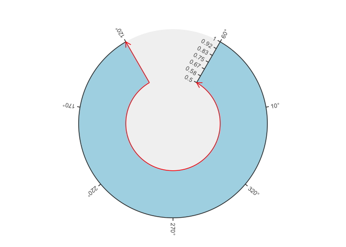
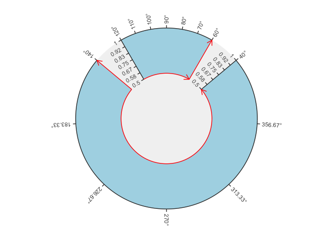

<!-- README.md is generated from README.Rmd. Please edit that file -->

# arcET

<!-- badges: start -->

[](https://lifecycle.r-lib.org/articles/stages.html#experimental)
<!-- badges: end -->

In some cases, the polar-coordinate plot in ‘ggplot2’ are not flexible
enough to meet actual needs. In contrast, the ‘circlize’ package is
flexible enough, but too complex for beginners. This package provides a
compromise solution that helps beginners to draw fast and well, and also
allows advanced users to use flexibly.

## Installation

You can install the development version of arcET like so:

``` r
## install.packages("devtools")
devtools::install_github("Hy4m/arcET", force = TRUE)
```

## Example

This is a basic example which shows you how to solve a common problem:

``` r
library(arcET)
library(ggplot2)

## ggplot2 plot
ggplot(mtcars, aes(wt, mpg)) + geom_point()
```


``` r
## transform
arc_test()
#> Build CellID_1 plot......[1/1]
```


``` r
library(arcET)
library(ggplot2)

## ggplot2 plot
p <- ggplot(mtcars, aes(wt, mpg)) + geom_point()

arcplot() |>
  init_cell(p, region = CELL(180, 0, 0.5)) |>
  within_plot(title = "wt vs mpg",
              xlim = c(-1.1, 1.1),
              ylim = c(-0.1, 1.1)) |>
  decorate_rect(ymin = 1,
                ymax = 1.1,
                fill = "steelblue",
                colour = NA,
                CellID = "CellID",
                fixed = FALSE) |>
  decorate_bannertext(label = "Bannertext annotation has done",
                      y = 1.05,
                      colour = "red",
                      CellID = "CellID",
                      fixed = FALSE)
#> Build CellID_2 plot......[1/1]
```



## `region` parameter

The `region` parameter (created by `CELL()` function) is used to set the
region location in polar coordinates, and it mainly has the following
four parameters: `start` and `end` are used to set the angle (in degree)
position of the start and end of the region; `r0` and `r1` are used to
set the radius of the start and end of the region. In addition, the
`direct` parameter controls the direction of the region. The default of
`direct` parameter is `clockwise`, but you can set to
`reverse.clockwise`.

The `show_cell()` function is a quick way to visualize what different
parameters do:

``` r
region <- CELL(start = 120, end = 60, r0 = 0.5, r1 = 1)

region ## print
#> 
#> ── --------CELLMETA information:-------- ───────────────────────────────────────
#> start -> 120 (in degree)
#> end -> 60 (in degree)
#> r0 -> 0.5 (in [0, 1])
#> r1 -> 1 (in [0, 1])
#> direct -> clockwise ('clockwise' or 'reverse.clockwise')
#> x.range -> [120, 60]
#> y.range -> [0.5, 1]
#> clip -> <function>
#> 
#> 
#> ── ------------------------------------ ────────────────────────────────────────
show_cell(region) ## visualize
```



``` r

## reverse.clockwise
region2 <- CELL(start = 120, end = 60, r0 = 0.5, r1 = 1,
                direct = "reverse.clockwise")
show_cell(region2)
```



``` r

## combine
show_cell(CELL(start = 120, end = 60, r0 = 0.5, r1 = 1),
          CELL(start = 140, end = 40, r0 = 0.5, r1 = 1,
               direct = "reverse.clockwise"))
```



## Notes

It is still in the phase of code testing and updating help
documentation, so many features and usage you may not be able to find
the corresponding documentation. In addition, `arcET` currently does not
support the special layer functions provided in other `ggplot2`
extensions, and of course I welcome everyone to submit PR to improve the
`arcET` package.

Finally, it must be noted that many functions in the `arcET` package
refer to or copy the corresponding function code in the `ggplot2`
package, and if I did not comment clearly in the source code, please
point out or submit an PR to fix it.
