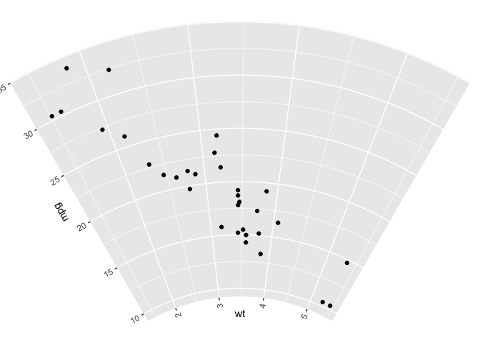

<!-- README.md is generated from README.Rmd. Please edit that file -->

# arcET

<!-- badges: start -->

[](https://lifecycle.r-lib.org/articles/stages.html#experimental)
<!-- badges: end -->

In some cases, the polar-coordinate plot in ‘ggplot2’ are not flexible
enough to meet actual needs. In contrast, the ‘circlize’ package is
flexible enough, but too complex for beginners. This package provides a
compromise solution that helps beginners to draw fast and well, and also
allows advanced users to use flexibly.

## Installation

You can install the development version of arcET like so:

``` r
## install.packages("devtools")
devtools::install_github("Hy4m/arcET", force = TRUE)
```

## Example

This is a basic example which shows you how to solve a common problem:

``` r
library(arcET)
library(ggplot2)
library(grid)

## ggplot2 plot
ggplot(mtcars, aes(wt, mpg)) + geom_point()
```


``` r
## transform
arc_test()
#> Build CellID_1 plot...
```



## Notes

It is still in the phase of code testing and updating help
documentation, so many features and usage you may not be able to find
the corresponding documentation. In addition, arcET currently does not
support the special layer functions provided in other ggplot2
extensions, and of course I welcome everyone to submit PR to improve the
arcET package.
